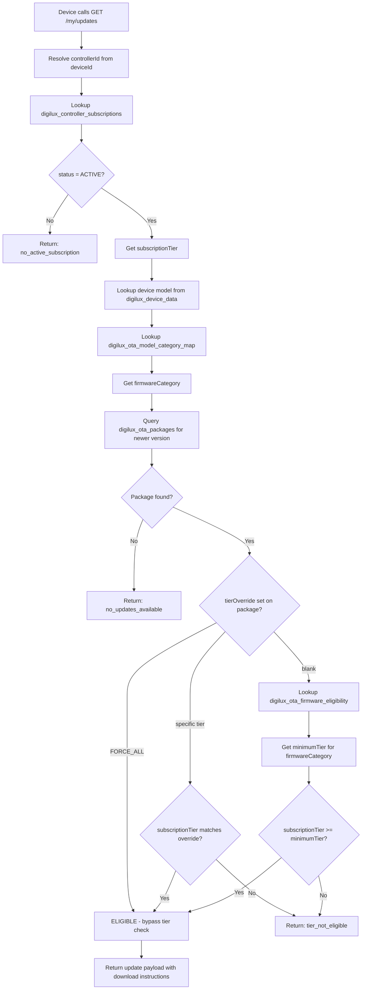
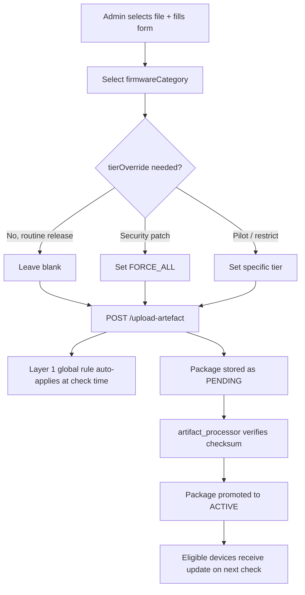

# Digilux OTA — Firmware Eligibility & Subscription Tier Design

**Version:** 1.0
**Date:** 2026-08-15
**Author:** Digilux Platform Team
**Status:** Proposed — Pending Engineering Approval

---

## Table of Contents

1. [Problem Statement](#1-problem-statement)
2. [Current State Analysis](#2-current-state-analysis)
3. [User Subscription Tiers](#3-user-subscription-tiers)
4. [Device Firmware Categories](#4-device-firmware-categories)
5. [Model → Category Mapping](#5-model--category-mapping)
6. [The Two-Layer Eligibility Model](#6-the-two-layer-eligibility-model)
7. [Eligibility Matrix](#7-eligibility-matrix)
8. [Use Cases](#8-use-cases)
9. [OTA Check Flow — End to End](#9-ota-check-flow--end-to-end)
10. [Data Model Changes](#10-data-model-changes)
11. [Why This is the Optimum Solution for Digilux](#11-why-this-is-the-optimum-solution-for-digilux)
12. [Industry Comparison](#12-industry-comparison)
13. [What Needs to Be Built](#13-what-needs-to-be-built)
14. [What Does NOT Change](#14-what-does-not-change)

---

## 1. Problem Statement

Digilux ships firmware updates to smart home devices via OTA (Over-The-Air). Today the system has no concept of:

- **Who** should receive a firmware update (any active device gets any update)
- **Which device category** a firmware package belongs to
- **Subscription tier** gating — free vs paying vs enterprise customers receive the same updates

This creates three critical business and technical risks:

| Risk | Impact |
|---|---|
| Enterprise-only deep stack firmware reaching free users | Controller instability, support burden |
| No tier differentiation | Cannot monetise firmware updates as a subscription feature |
| Admin must manually decide eligibility per upload | Human error, inconsistent rollouts |

This document defines the **Firmware Eligibility & Subscription Tier** design that solves all three.

---

## 2. Current State Analysis

### What was found in production

After scanning DynamoDB tables across both Digilux production and dev environments:

#### `digilux_controller_subscriptions`
```
controllerId          → "digilux-782288e9a98b"
subscriptionId        → "sub-test-001"
status                → "ACTIVE"
subscriptionExpiresAt → "2027-01-01T00:00:00Z"
entitlementVersion    → 28
```
**Finding:** Subscription is already **controller-centric** (tied to the hardware, not the user). This is correct for a smart home product. However, there is **no `subscriptionTier` field** — it is binary (ACTIVE or not).

#### `digilux_honeywell_user_device_details`
```
model:        "ZB_Network_controller"
protocolType: "Zigbee"
deviceType:   10
manufacturer: "Digilux"
```
**Finding:** The `model` field is captured at device registration. The firmware category **can be derived** from this field. No changes to the device registration flow are needed.

#### `digilux_device_data` (OTA table)
```
thingName:         "digilux-94ba062a250c"
installedVersions: { "controller-app": "2.0.0" }
```
**Finding:** The OTA table has no `model` or `firmwareCategory`. When a device calls `/my/updates`, the system currently has no way to determine what category of firmware it should receive.

#### `digilux_entitlement_audit_log`
**Finding:** An entitlement system (`digilux_entitlement_publisher` Lambda) already exists and is logging events. The infrastructure for entitlement enforcement is partially in place.

### Gap Summary

```
What exists today                     What is missing
─────────────────────────────────     ───────────────────────────────────
✓ Controller-centric subscriptions    ✗ Subscription tier (FREE/STANDARD/
✓ Model field on registered devices     PREMIUM/ENTERPRISE)
✓ Entitlement publisher Lambda        ✗ Firmware category on packages
✓ OTA job creation and delivery       ✗ Model → category mapping
✓ installedVersions tracking          ✗ Eligibility check in /my/updates
```

---

## 3. User Subscription Tiers

### Tier Definitions

```
┌─────────────────────────────────────────────────────────────────────────┐
│  FREE                                                                   │
│  ─────────────────────────────────────────────────────────────────────  │
│  Subscription expired or never activated.                               │
│  Hardware functions but no firmware updates are delivered.              │
│  OTA system returns: { updatesAvailable: false, reason: "no_active_    │
│  subscription" }                                                        │
└─────────────────────────────────────────────────────────────────────────┘

┌─────────────────────────────────────────────────────────────────────────┐
│  STANDARD                                                               │
│  ─────────────────────────────────────────────────────────────────────  │
│  Entry-level paid subscription.                                         │
│  Receives: Panel firmware + End-device firmware (Zigbee, WiFi)          │
│  Delivery: Silent push — update happens automatically                   │
│  Consent: Not required                                                  │
└─────────────────────────────────────────────────────────────────────────┘

┌─────────────────────────────────────────────────────────────────────────┐
│  PREMIUM                                                                │
│  ─────────────────────────────────────────────────────────────────────  │
│  Mid-tier subscription.                                                 │
│  Receives: All STANDARD + MCU firmware + Network Controller firmware    │
│  Delivery: Consent-based — user approves before update begins           │
│  Consent: Required (uses existing /my/updates/consent endpoint)         │
│  Rationale: NC firmware failure = entire site offline. User must be     │
│  aware and agree before we proceed.                                     │
└─────────────────────────────────────────────────────────────────────────┘

┌─────────────────────────────────────────────────────────────────────────┐
│  ENTERPRISE                                                             │
│  ─────────────────────────────────────────────────────────────────────  │
│  Top-tier, typically B2B (hotels, hospitals, smart buildings).          │
│  Receives: All PREMIUM + Zigbee Stack + Z2M controller firmware         │
│  Delivery: Admin-scheduled, maintenance window only                     │
│  Consent: Managed by site administrator, not end user                   │
│  Rationale: Stack firmware can brick the controller. Only enterprise    │
│  customers with on-site support should receive these updates.           │
└─────────────────────────────────────────────────────────────────────────┘
```

### Tier Hierarchy

```
ENTERPRISE  ⊇  PREMIUM  ⊇  STANDARD  ⊇  FREE
```

A higher tier always includes everything below it. This means a single `minimumTier` field is sufficient to express eligibility — no complex inclusion lists needed.

### Where Tier is Stored

`digilux_controller_subscriptions` — add `subscriptionTier` field:

```json
{
  "controllerId": "digilux-782288e9a98b",
  "subscriptionId": "sub-test-001",
  "status": "ACTIVE",
  "subscriptionTier": "PREMIUM",
  "subscriptionExpiresAt": "2027-01-01T00:00:00Z",
  "entitlementVersion": 28
}
```

**Why controller-centric (not user-centric)?**
A household may have multiple users (owner, family members, sub-users). The subscription belongs to the **installation** — the controller — not to any individual user account. This matches how the existing entitlement system already works.

---

## 4. Device Firmware Categories

Digilux hardware falls into three blast-radius classes. This classification drives the entire eligibility model.

### Class A — End Device (Low Risk)

If an end-device OTA fails, **one device** goes offline. The rest of the site is unaffected.

| Category ID | Description | Example Models |
|---|---|---|
| `PANEL_FIRMWARE` | Touch panels and display units | DLX-PANEL-* |
| `DEVICE_ZIGBEE` | End-device Zigbee firmware | DLX-BULB-*, DLX-FAN-*, DLX-SW-* |
| `DEVICE_WIFI` | End-device WiFi firmware | DLX-WIFI-* |
| `DEVICE_MCU` | End-device MCU/microcontroller | DLX-MCU-* |

### Class B — Network Controller (High Risk)

If a network controller OTA fails, **the entire site goes offline**. Every device in the home that routes through this controller loses connectivity.

| Category ID | Description |
|---|---|
| `NC_ZIGBEE` | Zigbee network controller main firmware |
| `NC_ETHERNET` | Zigbee network controller ethernet module |
| `NC_MISCELLANEOUS` | Network controller miscellaneous components |

### Class C — Controller Stack (Critical Risk)

If a stack-level OTA fails mid-flash, **the controller can be bricked** — requiring physical intervention or RMA. These updates should only reach customers who have on-site support capability.

| Category ID | Description |
|---|---|
| `NC_ZIGBEE_STACK` | Zigbee protocol stack firmware |
| `NC_Z2M` | Zigbee2MQTT (Z2M) controller firmware |

### Blast Radius Visualisation

```
                    ┌─────────────────────────────────┐
                    │       Smart Home Site            │
                    │                                  │
                    │   ┌──────────────────────────┐   │
                    │   │   Network Controller     │   │
                    │   │   (Class B + C firmware) │   │
                    │   └────────────┬─────────────┘   │
                    │                │                  │
                    │     ┌──────────┼──────────┐       │
                    │     ▼          ▼          ▼       │
                    │  [Panel]   [Bulbs]   [Switches]   │
                    │  Class A   Class A    Class A      │
                    │                                  │
                    └─────────────────────────────────┘

  If Class A OTA fails → 1 device offline
  If Class B OTA fails → entire site offline
  If Class C OTA fails → controller bricked, site offline + RMA risk
```

---

## 5. Model → Category Mapping

The `model` field is already captured in `digilux_honeywell_user_device_details` at registration time. Instead of changing the device registration flow, we derive firmware category from this existing field using a lookup table.

### Mapping Table: `digilux_ota_model_category_map`

| `modelPattern` | `firmwareCategory` | `deviceClass` |
|---|---|---|
| `ZB_Network_controller` | `NC_ZIGBEE` | `NETWORK_CONTROLLER` |
| `ETH_Network_controller` | `NC_ETHERNET` | `NETWORK_CONTROLLER` |
| `DLX-PANEL-*` | `PANEL_FIRMWARE` | `END_DEVICE` |
| `DLX-BULB-*` | `DEVICE_ZIGBEE` | `END_DEVICE` |
| `DLX-FAN-*` | `DEVICE_ZIGBEE` | `END_DEVICE` |
| `DLX-SW-*` | `DEVICE_ZIGBEE` | `END_DEVICE` |
| `DLX-WIFI-*` | `DEVICE_WIFI` | `END_DEVICE` |
| `DLX-MCU-*` | `DEVICE_MCU` | `END_DEVICE` |

**Key design principle:** When the firmware team adds a new hardware model, they add **one row** to this table. No Lambda code changes required.

---

## 6. The Two-Layer Eligibility Model

This is the core of the design. Two independent layers work together to determine whether a device receives a firmware update.

```
┌─────────────────────────────────────────────────────────────────────┐
│                    ELIGIBILITY DECISION                             │
│                                                                     │
│   Layer 2 (Per-Package Override)                                    │
│   ┌─────────────────────────────────────────────────────────────┐   │
│   │  tierOverride field on digilux_ota_packages                 │   │
│   │                                                             │   │
│   │  FORCE_ALL   → bypass Layer 1, push to everyone            │   │
│   │  ENTERPRISE  → restrict to Enterprise only                 │   │
│   │  (blank)     → fall through to Layer 1                     │   │
│   └─────────────────────┬───────────────────────────────────────┘   │
│                         │ if blank                                   │
│                         ▼                                           │
│   Layer 1 (Global Rules Table)                                      │
│   ┌─────────────────────────────────────────────────────────────┐   │
│   │  digilux_ota_firmware_eligibility                           │   │
│   │                                                             │   │
│   │  firmwareCategory → minimumTier                            │   │
│   │  PANEL_FIRMWARE   → STANDARD                               │   │
│   │  NC_ZIGBEE_STACK  → ENTERPRISE                             │   │
│   │  ...                                                        │   │
│   └─────────────────────────────────────────────────────────────┘   │
└─────────────────────────────────────────────────────────────────────┘
```

### Layer 1 — Global Rules Table (Automatic)

**Table:** `digilux_ota_firmware_eligibility`

| `firmwareCategory` | `minimumTier` | Rationale |
|---|---|---|
| `PANEL_FIRMWARE` | `STANDARD` | Low risk, core product feature |
| `DEVICE_ZIGBEE` | `STANDARD` | Low risk, core product feature |
| `DEVICE_WIFI` | `STANDARD` | Low risk, core product feature |
| `DEVICE_MCU` | `PREMIUM` | Higher risk, firmware team expertise needed |
| `NC_ZIGBEE` | `PREMIUM` | Site-level blast radius |
| `NC_ETHERNET` | `PREMIUM` | Site-level blast radius |
| `NC_MISCELLANEOUS` | `PREMIUM` | Site-level blast radius |
| `NC_ZIGBEE_STACK` | `ENTERPRISE` | Controller brick risk |
| `NC_Z2M` | `ENTERPRISE` | Controller brick risk |

**Who manages it:** Product team, once at launch. Rarely changes.
**Admin involvement at upload:** Zero. Upload a package → eligibility is automatic.

### Layer 2 — Per-Package Override (Admin Decision)

**Field:** `tierOverride` on `digilux_ota_packages`

| Override Value | Behaviour |
|---|---|
| *(blank)* | Inherit from Layer 1 global rule |
| `FORCE_ALL` | Push to all tiers regardless of subscription — for critical security patches |
| `ENTERPRISE` | Restrict to ENTERPRISE only — for customer pilots or beta programs |
| `PREMIUM` | Restrict to PREMIUM+ — e.g. restrict normally-STANDARD update for a specific build |

**Who manages it:** Admin at upload time, only when needed.
**Default:** Blank — admin makes zero decisions for routine releases.

---

## 7. Eligibility Matrix

The combined result of Layer 1 (default) applied to all firmware categories:

```
Firmware Category    │ FREE │ STANDARD │ PREMIUM │ ENTERPRISE
─────────────────────┼──────┼──────────┼─────────┼───────────
PANEL_FIRMWARE       │  ✗   │    ✓     │    ✓    │     ✓
DEVICE_ZIGBEE        │  ✗   │    ✓     │    ✓    │     ✓
DEVICE_WIFI          │  ✗   │    ✓     │    ✓    │     ✓
DEVICE_MCU           │  ✗   │    ✗     │    ✓    │     ✓
─────────────────────┼──────┼──────────┼─────────┼───────────
NC_ZIGBEE            │  ✗   │    ✗     │    ✓    │     ✓
NC_ETHERNET          │  ✗   │    ✗     │    ✓    │     ✓
NC_MISCELLANEOUS     │  ✗   │    ✗     │    ✓    │     ✓
─────────────────────┼──────┼──────────┼─────────┼───────────
NC_ZIGBEE_STACK      │  ✗   │    ✗     │    ✗    │     ✓
NC_Z2M               │  ✗   │    ✗     │    ✗    │     ✓
```

---

## 8. Use Cases

### UC-01: Routine Panel Firmware Release

**Context:** Firmware team releases a new touch panel build with UI improvements.

```
Admin uploads:   PANEL_FIRMWARE v3.1.0
                 tierOverride = (blank)

Layer 2 check:   No override → fall to Layer 1
Layer 1 check:   PANEL_FIRMWARE → minimumTier = STANDARD

Result:          All STANDARD, PREMIUM, ENTERPRISE controllers
                 receive this update automatically.
                 FREE controllers receive nothing.
Admin effort:    Zero eligibility decisions made.
```

---

### UC-02: Critical Security Patch — All Tiers

**Context:** A vulnerability is found in the Zigbee stack. All devices must be patched immediately, regardless of subscription.

```
Admin uploads:   NC_ZIGBEE_STACK v2.0.1  (security fix)
                 tierOverride = FORCE_ALL

Layer 2 check:   FORCE_ALL → bypass Layer 1 entirely

Result:          ALL controllers receive this update, including FREE.
                 Normal tier restriction is lifted.
Admin effort:    Admin sets tierOverride = FORCE_ALL at upload time.
```

---

### UC-03: Customer-Specific Enterprise Pilot

**Context:** A large hotel chain (enterprise customer) is piloting a new Z2M build before general release.

```
Admin uploads:   NC_Z2M v1.9.0-beta
                 tierOverride = ENTERPRISE

Layer 2 check:   Override = ENTERPRISE → only ENTERPRISE controllers
Layer 1 check:   Skipped (override is set)

Result:          Only ENTERPRISE tier controllers receive this build.
                 PREMIUM customers are excluded even though they would
                 normally receive Z2M updates if minimumTier were PREMIUM.
Admin effort:    Admin sets tierOverride = ENTERPRISE at upload time.
```

---

### UC-04: Standard Customer Checks for Updates — Eligible

**Context:** A STANDARD subscriber's touch panel checks for updates.

```
Device:          DLX-PANEL-500
model lookup:    DLX-PANEL-* → PANEL_FIRMWARE
tier lookup:     controllerId → subscriptionTier = STANDARD

Layer 1 check:   PANEL_FIRMWARE → minimumTier = STANDARD
Comparison:      STANDARD ≥ STANDARD → ELIGIBLE

Result:          { updatesAvailable: true, version: "3.1.0", ... }
```

---

### UC-05: Standard Customer Checks for Updates — Ineligible

**Context:** A STANDARD subscriber's network controller checks for a Z2M update.

```
Device:          ZB_Network_controller
model lookup:    ZB_Network_controller → NC_ZIGBEE
tier lookup:     controllerId → subscriptionTier = STANDARD

Layer 1 check:   NC_ZIGBEE → minimumTier = PREMIUM
Comparison:      STANDARD < PREMIUM → NOT ELIGIBLE

Result:          { updatesAvailable: false, reason: "tier_not_eligible" }
                 No update delivered. No error shown to user.
```

---

### UC-06: Subscription Expires Mid-Cycle

**Context:** A PREMIUM customer's subscription expires. Their controller checks for updates the next day.

```
Device calls:    GET /my/updates
tier lookup:     controllerId → status = INACTIVE (expired)

Eligibility:     status = INACTIVE → treat as FREE regardless of
                 previous tier

Result:          { updatesAvailable: false, reason: "subscription_inactive" }
                 Update delivery pauses until subscription is renewed.
                 Previously installed firmware continues to function.
```

---

### UC-07: New Hardware Model Added

**Context:** Firmware team releases a new WiFi-enabled panel model `DLX-PANEL-WIFI-100`.

```
Action required: Add one row to digilux_ota_model_category_map:
                 modelPattern = "DLX-PANEL-WIFI-*"
                 firmwareCategory = "PANEL_FIRMWARE"
                 deviceClass = "END_DEVICE"

No code change.  Next time a DLX-PANEL-WIFI-100 device calls
                 /my/updates, it is correctly categorised and
                 receives PANEL_FIRMWARE updates from STANDARD tier up.
```

---

### UC-08: Tier Change for a Firmware Category

**Context:** Product decision — MCU firmware is now considered stable enough to release to STANDARD tier.

```
Action required: Update one row in digilux_ota_firmware_eligibility:
                 firmwareCategory = DEVICE_MCU
                 minimumTier: PREMIUM → STANDARD

No code change.  All future /my/updates checks for DEVICE_MCU packages
                 will now resolve as eligible for STANDARD controllers.
                 Previously uploaded packages automatically benefit.
```

---

## 9. OTA Check Flow — End to End

### Device Calls `GET /my/updates`



### Admin Uploads Firmware



---

## 10. Data Model Changes

### New Tables

#### `digilux_ota_model_category_map`
```
PK: modelPattern (String)

Fields:
  firmwareCategory  String   e.g. "NC_ZIGBEE", "PANEL_FIRMWARE"
  deviceClass       String   "END_DEVICE" | "NETWORK_CONTROLLER"
  description       String   Human-readable label
  createdAt         String   ISO timestamp
  updatedAt         String   ISO timestamp
```

#### `digilux_ota_firmware_eligibility`
```
PK: firmwareCategory (String)

Fields:
  minimumTier   String   "STANDARD" | "PREMIUM" | "ENTERPRISE"
  deviceClass   String   "END_DEVICE" | "NETWORK_CONTROLLER"
  description   String   Human-readable label
  updatedAt     String   ISO timestamp
  updatedBy     String   Admin email who last changed this rule
```

### Modified Tables

#### `digilux_controller_subscriptions` — add field
```
subscriptionTier  String   "FREE" | "STANDARD" | "PREMIUM" | "ENTERPRISE"
```

#### `digilux_ota_packages` — add fields
```
firmwareCategory  String   e.g. "NC_ZIGBEE", "PANEL_FIRMWARE"
tierOverride      String   "FORCE_ALL" | "ENTERPRISE" | "PREMIUM" | null
```

### Tier Ordering (for comparison logic)

```python
TIER_ORDER = {
    "FREE":       0,
    "STANDARD":   1,
    "PREMIUM":    2,
    "ENTERPRISE": 3,
}

def is_eligible(subscription_tier, minimum_tier):
    return TIER_ORDER[subscription_tier] >= TIER_ORDER[minimum_tier]
```

---

## 11. Why This is the Optimum Solution for Digilux

### 11.1 It Works With What Already Exists

The design was built entirely from what was found in production:

- Subscription is **already controller-centric** in `digilux_controller_subscriptions` — we add one field, not a new concept
- The `model` field is **already captured** at device registration — we derive category from it, zero changes to registration flow
- The entitlement infrastructure (`digilux_entitlement_publisher`) **already exists** — the eligibility check plugs into an established pattern
- `installedVersions` **already tracks** per-package versions — the comparison logic is already there

**No architectural U-turns. Pure additive change.**

### 11.2 Blast Radius Drives Tier Boundaries

The tier boundary between STANDARD and PREMIUM is not arbitrary — it is defined by the blast radius of a failed update:

- **STANDARD boundary:** end devices. One device fails → one device affected. Acceptable risk for all paying subscribers.
- **PREMIUM boundary:** network controller. Failure = entire site offline. Only subscribers who understand the risk and have opted into the higher tier.
- **ENTERPRISE boundary:** controller stack (Zigbee Stack, Z2M). Failure = potential brick. Only customers with on-site support capability.

The tier structure is **risk-derived**, not commercially arbitrary. This makes it defensible to both customers and the support team.

### 11.3 Zero Admin Overhead for Routine Releases

The most common case — routine firmware release — requires **zero eligibility decisions from the admin**. Upload the file, select the firmware category, done. The global rules table handles the rest.

Admin decisions are only required for exceptions (security patches, pilots), not the norm.

### 11.4 Model-Driven Category Derivation is Future-Safe

By mapping `model → firmwareCategory` in a DynamoDB table rather than hardcoding in Lambda:

- New hardware models are onboarded with a DynamoDB write, not a code deployment
- The firmware team and product team can manage the mapping without engineering involvement
- Category reassignment (e.g. a model moves from END_DEVICE to NETWORK_CONTROLLER class) is a one-row update

### 11.5 The Two-Layer Model Handles Every Business Scenario

| Scenario | Layer | Mechanism |
|---|---|---|
| Routine release | Layer 1 | Global rule, automatic |
| Security emergency | Layer 2 | FORCE_ALL override |
| Customer pilot | Layer 2 | Tier restriction override |
| New hardware model | Layer 1 | Add row to mapping table |
| Tier policy change | Layer 1 | Update row in eligibility table |
| Subscription expiry | Tier lookup | status=INACTIVE → treated as FREE |

There is no business scenario that falls outside these two layers.

---

## 12. Industry Comparison

| Product | Approach | Similarity to Digilux Design |
|---|---|---|
| **Sonos** | Global rules per device model, automatic | Layer 1 only — no per-package override |
| **Nest / Google Home** | Global tier rules + per-release admin override | Closest match — both layers present |
| **Samsung SmartThings** | Capability-model driven globally + admin force-push | Both layers, force-push = FORCE_ALL |
| **Philips Hue** | Pure global rules, no override | Layer 1 only — simpler but less flexible |

Digilux most closely follows the **Nest/Google Home** pattern — the most mature and flexible model in the consumer IoT space — adapted for a controller-centric hardware topology.

---

## 13. What Needs to Be Built

### Sprint 1 — Foundation (required before any eligibility logic)

| Item | Type | Effort |
|---|---|---|
| Create `digilux_ota_model_category_map` table | DynamoDB | Low |
| Create `digilux_ota_firmware_eligibility` table | DynamoDB | Low |
| Seed both tables with initial data | Script | Low |
| Add `subscriptionTier` to `digilux_controller_subscriptions` | DynamoDB attribute | Low |
| Add `firmwareCategory` + `tierOverride` to `digilux_ota_packages` | DynamoDB attribute | Low |

### Sprint 2 — Upload Flow Changes

| Item | Type | Effort |
|---|---|---|
| `digilux_ota_upload_url` Lambda — require `firmwareCategory` in request | Lambda | Medium |
| `digilux_ota_upload_url` Lambda — accept optional `tierOverride` | Lambda | Low |
| Admin web interface — add `firmwareCategory` dropdown to Upload page | React | Low |
| Admin web interface — add `tierOverride` selector to Upload page | React | Low |

### Sprint 3 — Eligibility Check

| Item | Type | Effort |
|---|---|---|
| `digilux_ota_user_check_updates` Lambda — 4-step eligibility check | Lambda | Medium |
| Unit tests for tier comparison logic | Tests | Medium |
| E2E test coverage for all 8 use cases | Tests | Medium |

### Sprint 4 — Admin Tooling

| Item | Type | Effort |
|---|---|---|
| Admin API to manage `digilux_ota_firmware_eligibility` rules | Lambda + API GW | Medium |
| Admin API to manage `digilux_ota_model_category_map` | Lambda + API GW | Medium |
| Admin web interface — Eligibility Rules management page | React | Medium |

---

## 14. What Does NOT Change

The following are explicitly **out of scope** — they remain exactly as they are:

- IoT Job creation flow (`digilux_ota_job_create`)
- S3 artifact storage (`digilux-ota-artifacts`)
- Multipart upload and checksum verification
- Artifact processor (`digilux_ota_artifact_processor`)
- Consent flow (`digilux_ota_user_consent`)
- Status reporting (`digilux_ota_user_update_status`)
- Download link generation (`digilux_ota_user_get_download_link`)
- Device registration flow
- Cognito user pools
- API Gateway routing

---

*Document ends.*

*Next step: Engineering review → Sprint 1 kickoff.*
